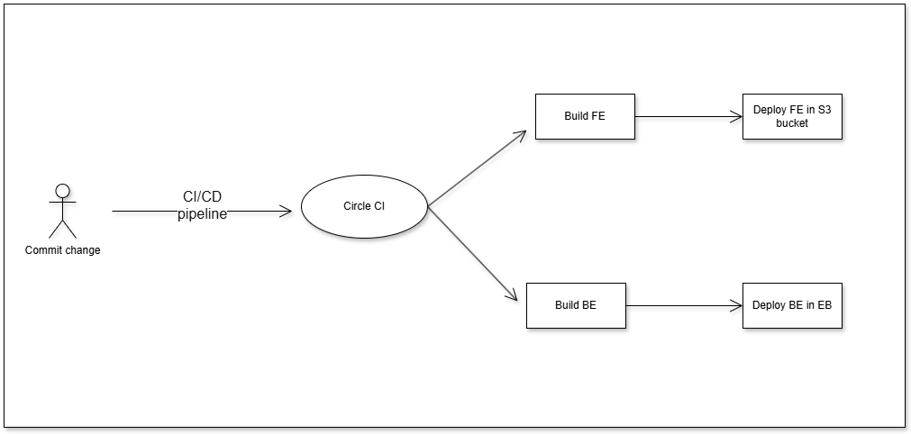

# Udagram Pipeline

## Overview
The Udagram project employs a continuous integration and deployment pipeline to ensure smooth and automated delivery of application updates. The pipeline leverages GitHub, CircleCI, and AWS services to streamline processes.
## Continuous Integration

### GitHub
The source code for the Udagram project is hosted on GitHub. The repository is integrated with CircleCI to trigger automated workflows whenever changes are pushed. This ensures that code updates are validated and deployed efficiently.
### CircleCI
CircleCI is configured to manage and execute the project's build and deployment processes. It reads the configuration file located at `.circleci/config.yml`. The pipeline consists of the following jobs:

#### 1. Backend Job
- Installing backend dependencies using npm run api:install.
- Building the backend API with npm run api:build.
- Deploy the application to Elastic Beanstalk.

#### 2. Frontend Job
- Installing frontend dependencies using npm run frontend:install.
- Linting the frontend application with npm run frontend:lint.
- Building the frontend application using npm run frontend:build.
- Uses the AWS CLI to upload built assets to an S3 bucket for hosting.

